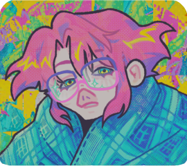
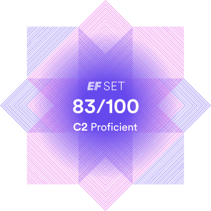

# Daria Kovaleva

## ⟣ contacts
- **phone**: +7 999 829 15 41
- **e-mail**: tetsus.christ@gmail.com
- **telegram**: [tetsus_christ](https://t.me/tetsus_christ)
- **discord:** [tetsus_christ](https://discord.com/users/tetsus_christ)
- **rs-school server nickname**: tets (tetsus-christ)

## ⟣ about me

i'm a complete newbie in web development, but i'm actively learning and eager to learn more. 

web development attracts me because for some reason i find coding a fun thing to do - especially when i can immediatly see the result, and it's interactive.

why do i think i can become a good developer? because i hate so many sites across the internet, and i want to be the change i want to see in the world.

in long term, i aim to become a full-stack developer - but that's later, let me get a handle on front-end first.

## ⟣ languages

**russian**: native

**english**: C2, according to EF SET, but it only tested my reading and listening skills. i guess my writing is somewhere around B2, and speaking is unknown because i don't get many opportunities to speak english. better get ready for my strong russian accent.

